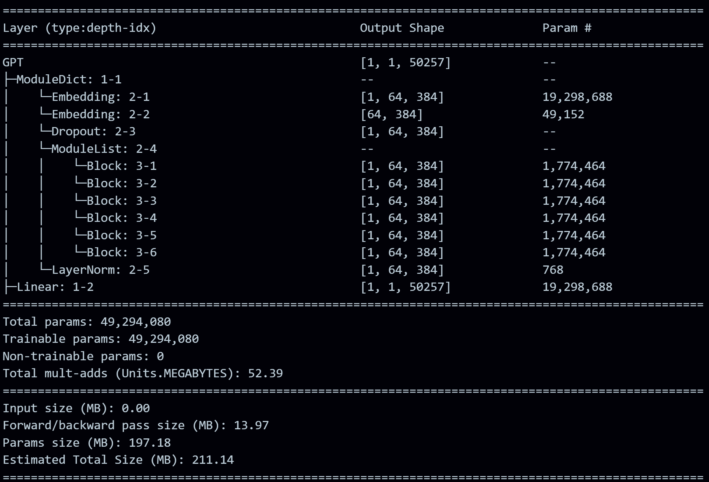

# 🧠 GPT-style Small Language Model (SLM)

> 🚀 A complete implementation of a GPT-style Transformer Language Model built **from scratch** using PyTorch.

---

## ✨ Overview

>💡 This project aims to deeply understand the internals of GPT-style models rather than relying on pre-built frameworks.

This demonstrates the design and implementation of a **decoder-only Transformer architecture**, inspired by GPT models.

The model is trained to generate human-like text using **autoregressive generation**, where each token is predicted based on previously generated tokens.


---

## 🔥 Highlights

* 🧱 Built **from scratch** (no high-level libraries like HuggingFace)
* 🧠 Implements **Transformer architecture (GPT-style)**
* 🔁 Autoregressive text generation
* ⚡ Supports **Flash Attention (PyTorch optimized)**
* 🔗 **Weight tying** between embedding & output layer
* 📊 ~50 Million parameters model
* 🖼️ Model architecture included

---

## 🏗️ Architecture

```text
Input Tokens
   ↓
Token Embedding + Positional Embedding
   ↓
Transformer Blocks × 6
   ├── LayerNorm
   ├── Multi-Head Self Attention (Causal)
   ├── Residual Connection
   ├── Feed Forward Network (MLP)
   └── Residual Connection
   ↓
Final LayerNorm
   ↓
Linear Head (Language Modeling Head)
   ↓
Next Token Prediction
```

---

## 🧠 Core Concepts Implemented

* ✅ Causal Self-Attention (masked attention)
* ✅ Multi-head attention mechanism
* ✅ Residual connections
* ✅ Layer Normalization
* ✅ Feed Forward Networks (MLP)
* ✅ Token + Positional Embeddings
* ✅ Temperature & Top-k sampling
* ✅ Autoregressive decoding

---

## 🖼️ Architecture 



---

## 📊 Model Configuration

| Parameter           | Value       |
| ------------------- | ----------- |
| Vocabulary Size     | 50,257      |
| Embedding Dimension | 384         |
| Transformer Layers  | 6           |
| Attention Heads     | 4           |
| Parameters          | ~49 Million |

---

## 📚 Dataset & Training

The model is trained on the **TinyStories dataset**, which is specifically designed for training small language models to generate simple and coherent stories.

### ⚡ Training Hardware

The model was trained using:

* 🖥️ **GPU:** NVIDIA RTX 4500 Ada Generation
* ⚡ CUDA-enabled acceleration for faster training

---

## 🧪 Results & Observations

### 📝 Sample Output 1

**Input Prompt:**

```
A little girl went to the woods
```

**Generated Output (excerpt):**

```
A little girl went to the woods.
The little girl had to go up the cave full of people and people flew away. 
The little girl was so happy that she had protected the emergency. 
One day, a little boy named Jack was learning something! 
He wanted to explore the world...
```

---

### 📝 Sample Output 2

**Input Prompt:**

```
The man who went
```

**Generated Output:**

```
The man who went to the park asked him, "What are you doing here?"

The man was confused. "Why are you doing here? What do you want to see?" she asked.
The stranger smiled. "It's a special girl. What do you think you will do it. It will be dangerous and I will try new things." He said, "I am here to break."

Lily nodded. She played with her friend. They had fun reading a lot...
```

---

### ✅ Observations

* The model generates **grammatically structured and readable sentences**
* Able to perform **multi-sentence story continuation**
* Demonstrates **basic dialogue generation**
* Captures **simple narrative flow and character introduction**
* Shows working **autoregressive behavior**

---

### ⚠️ Limitations

* ❌ Occasional **context inconsistency** (character switching)
* ❌ Some **illogical or unrealistic phrases**
* ❌ Repetition and abrupt transitions
* ❌ Limited long-range coherence

---

### 🧠 Analysis

These results indicate that:

* The model successfully learns **language structure and syntax**
* It captures **basic storytelling patterns**
* However, performance is limited due to:

  * Small model size (~50M parameters)
  * Limited dataset (TinyStories)
  * Fewer training iterations

---

### 🎯 Conclusion

Despite limitations, the model demonstrates:

* ✔ Ability to generate meaningful text
* ✔ Understanding of sentence formation
* ✔ Basic storytelling capability

This validates the effectiveness of **Transformer-based Small Language Models (SLMs)** for learning language generation from scratch.


## 🚀 Getting Started

### 1️⃣ Clone the Repository

```bash
git clone https://github.com/arup04/GPT-style-Small-Language-Model-SLM-.git
cd GPT-style-Small-Language-Model-SLM-
```

---

### 2️⃣ Install Dependencies

#### Create virtual environment

```bash
uv venv
```

#### activate venv
```bash
.venv\Scripts\activate
```

#### install libraries
```bash
uv pip install -r requirements.txt
```


---

## 📂 Project Structure

```text
├── slm.ipynb                  # Main training & inference notebook
├── requirements.txt          # Dependencies
├── Final_SLM_Architecture.png
├── README.md
├── .gitignore
```

---

## 🔮 Future Improvements

* 🚀 Convert notebook → modular codebase (train.py, model.py)
* 🌐 Deploy with FastAPI / Streamlit
* 🧠 Fine-tune on larger datasets
* 📈 Add evaluation metrics (perplexity)

---

## 💡 Key Learnings

This project helped in understanding:

* Transformer architecture in depth
* Attention mechanisms (Query, Key, Value)
* How GPT models generate text
* Training and inference workflows

---

## 🎯 Conclusion

This project successfully demonstrates how a GPT-style model can be built and trained from scratch.

Even with a relatively small size, the model shows the ability to learn language patterns and generate coherent text, making it a strong foundation for understanding modern LLMs.

---

